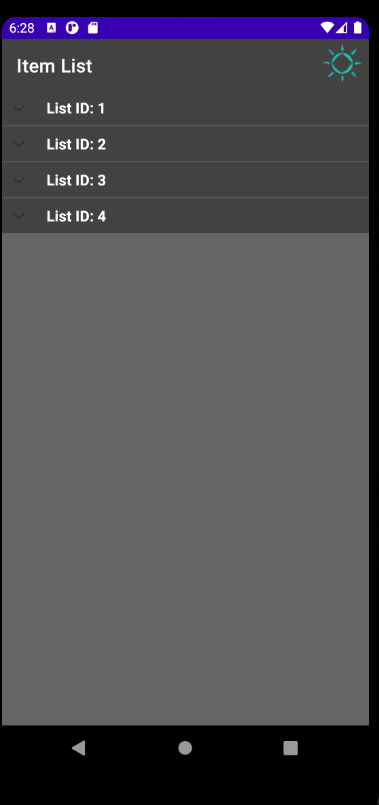
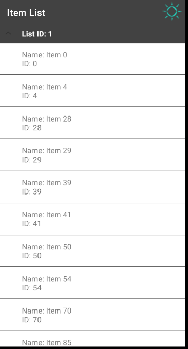

 

  

  <h1 align="center">FetchApp</h1>

  

     
  

  
 <h3>Installation</h3>
  Clone this repository and import into <b>Android Studio</b>
   
<h3>About the Project</h3>
The Project was built using Java on Android Studio. Here is a few screenshots of the output.

